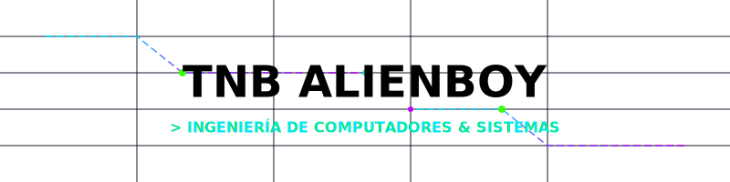

<!-- CYBER-HEADER -->

  <!-- Carga del banner animado SVG desde el archivo del repositorio para asegurar funcionamiento del estilo CSS -->
  

  <h3>⚡ TRANQUILINO MBA (TNB ALIENBOY) ⚡</h3>

  

    
  

  

    
    
    
    
  

---

### 👤 Perfil de Ingeniería
Soy **Ingeniero de Computadores & Sistemas**, especializado en la arquitectura de **sistemas backend escalables, redes empresariales y automatizaciones agent-first**. Orientado al diseño e implementación de algoritmos de alta eficiencia, seguridad informática en infraestructuras locales y en la nube, y automatización inteligente mediante integraciones avanzadas de modelos de lenguaje (LLMs).

* 🌍 Ubicación: **Guinea Ecuatorial** 🇬🇶
* 🏛️ Colaboración: Investigador tecnológico en la **AAUCA** (Universidad Afro-Americana de África Central)
* 🛸 Foco Actual: Desarrollo Agent-First con LLMs y automatización de procesos mediante infraestructura inteligente.

---

### 🛠️ Mis Pilares de Habilidades

* **💻 01 / Full-Stack & Core Software**
         

* **🌐 02 / Sistemas, Redes & Seguridad**
       

* **🧠 03 / Ingeniería de IA & Automatización**
       

* **🛠️ 04 / Entornos & Herramientas DevOps**
       

---

### 🏆 The Trophy Case (Proyectos Insignia)

#### 🌾 AGROTEC GUINEA (Nfomsi) — *1er Puesto* 🏆
> Aplicación móvil e inteligente de diagnóstico agrícola que detecta anomalías y plagas vegetales mediante visión computacional y modelos de IA en la nube.
* **Tecnologías:** `Python` • `Django` • `APIs LLM` • `Google Cloud`
* 🔗 [Ver Código en GitHub](https://github.com/Tranquilino1/AGROTEC-GUINEA)

---

#### 🛰️ INTELIJGPS — *En Producción* 📡
> Backend robusto de tracking vehicular y geocercas en tiempo real, diseñado con arquitectura de hilos asíncronos y WebSockets para soportar baja latencia.
* **Tecnologías:** `Java Spring Boot` • `Maven` • `MySQL` • `WebSockets`
* 🔗 [Ver Código en GitHub](https://github.com/Tranquilino1/INTELIJGPS)

---

#### 🎓 AAUCATools Community — *Live* ⚡
> Portal web universitario que centraliza herramientas inteligentes de IA para optimizar la productividad y tareas académicas de los alumnos de la AAUCA.
* **Tecnologías:** `TypeScript` • `Angular` • `Vercel` • `Serverless`
* 🔗 [Ver Código en GitHub](https://github.com/Tranquilino1/aauca-tools-community)

---

### 📊 Telemetría de Contribuciones (Cyberpunk Theme)

  
  

  

---

### 🗓️ Live Terminal (Actividad de Código Reciente)
<!--START_SECTION:activity-->
<!--END_SECTION:activity-->

 

  
<i>"Compilando flujos eficientes de hardware y software, forzando los límites del cómputo en la red."</i>

